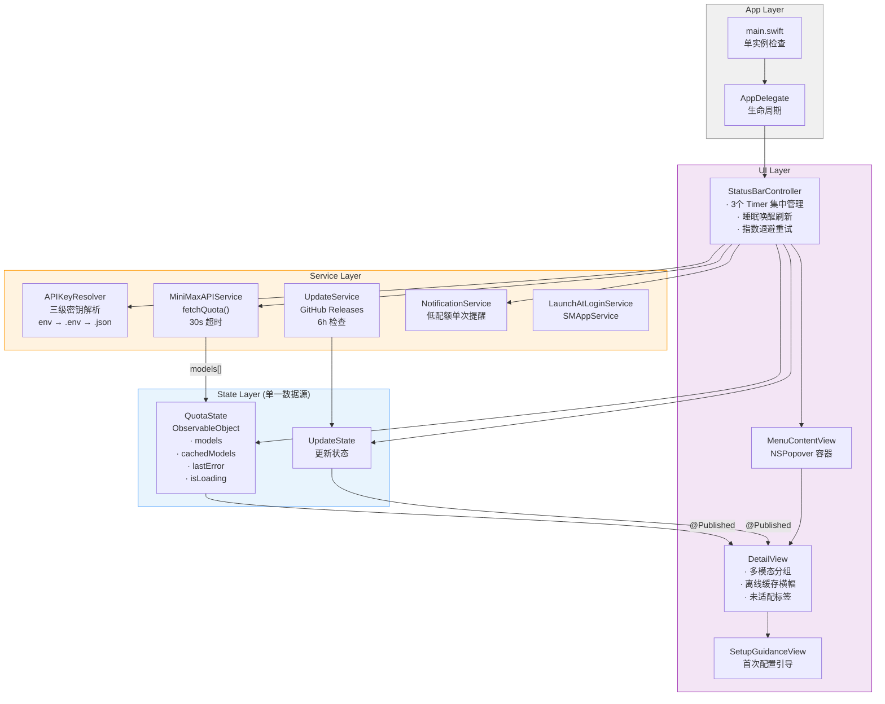

<div align="center">

# MiniMax Status Bar

**macOS 菜单栏配额感知工具**

为每天重度使用 MiniMax M2.7 的开发者而生——瞟一眼就知道还剩多少、什么时候重置。

[](https://github.com/victor0602/minimax-status-bar/releases/latest)
[](https://github.com/victor0602/minimax-status-bar/releases/latest)
[](https://swift.org)
[](LICENSE)

</div>

---

## 产品定位

这是一个**感知工具，不是操作工具**。

核心用户是把 MiniMax M2.7 作为日常主力模型的开发者——通过 OpenClaw、Claude Code、Cursor 等工具每天消耗大量 Token Plan 配额。他们的痛点不是"不知道有用量限制"，而是**"不知道现在还剩多少、什么时候重置"**，在高强度工作流里额度悄悄耗尽是真实发生的事。

```
菜单栏                          下拉菜单
┌─────────────────────────────┐  ┌──────────────────────────────────┐
│  🟢 2.7·72%                 │  │  MiniMax    ↻  [⌘R]             │
└─────────────────────────────┘  │  最后更新：30秒前                │
                                 ├──────────────────────────────────┤
悬停 Tooltip：                   │  TEXT                            │
MiniMax-M2.7 · 剩余 72%         │  ┌─────────────────────────────┐ │
重置 2h 30m · 下拉查看全部模态   │  │  MiniMax-M2.7        剩余72%│ │
                                 │  │  ████████████░░░░   已用28% │ │
                                 │  │  剩余 72,000 / 100,000      │ │
                                 │  │  重置: 2h 30m               │ │
                                 │  └─────────────────────────────┘ │
                                 │  VIDEO                           │
                                 │  ┌─────────────────────────────┐ │
                                 │  │  Hailuo-2.3          剩余45%│ │
                                 │  └─────────────────────────────┘ │
                                 ├──────────────────────────────────┤
                                 │  [退出]  [开机启动]  [控制台]    │
                                 │                         v2.0.0   │
                                 └──────────────────────────────────┘
```

---

## 核心特性

**零配置**：自动读取 `MINIMAX_API_KEY` 环境变量和 OpenClaw 配置，安装后无需任何设置。

**零打扰**：纯菜单栏 App（LSUIElement），没有 Dock 图标，没有窗口，只在需要时存在。低配额通知每次重置周期只推送一次。

**数据可信**：与 MiniMax 控制台语义完全一致，"剩余"就是剩余，不是已用。两次 API 轮询之间每 30 秒刷新菜单栏倒计时，始终显示准确的重置时间。

**容错稳定**：API 失败时展示上次缓存数据（标注时效），指数退避重试（2s → 4s → 8s），睡眠唤醒后立即刷新。

| 功能 | 说明 |
|---|---|
| 菜单栏一眼感知 | 颜色点（🟢 >30% / 🟡 >10% / 🔴 ≤10%）+ 主力缩写 + 剩余百分比 |
| 多模态分组 | Text / Speech / Video / Music / Image 分组展示，适合多产品线开发者 |
| 离线缓存 | API 不可达时保留上次有效数据，标注数据时效，不显示空白页 |
| 低配额通知 | 主力模型 <10% 推送一次，回到 ≥20% 后允许再次提醒 |
| 自动更新 | 检测 GitHub Releases，一键下载安装并重启，无需手动操作 |
| 新模型兜底 | 未适配的新模型标注「未适配」标签，不静默丢失数据 |
| 首次引导 | 无 Key 或 Key 格式错误时显示引导页，而不是错误堆栈 |

---

## 安装

### 下载 Release（推荐）

1. 前往 [Releases](https://github.com/victor0602/minimax-status-bar/releases/latest) 下载最新 `.dmg`
2. 打开 DMG，将 **MiniMax Status Bar** 拖入**应用程序**文件夹
3. 首次启动若提示无法打开：**系统设置 → 隐私与安全性 → 仍要打开**

若提示"文件已损坏"，在终端执行：

```bash
xattr -cr "/Applications/MiniMax Status Bar.app"
```

> 该提示由 macOS Gatekeeper 的 ad-hoc 签名策略触发，不影响实际安全性。

---

## 配置 API Key

App 按以下优先级自动读取 Token Plan API Key，**无需手动配置**：

1. 环境变量 `MINIMAX_API_KEY`
2. `~/.openclaw/.env` 中的 `MINIMAX_API_KEY=…`
3. `~/.openclaw/openclaw.json` 中的 `models.providers.minimax.apiKey` 或 `env.MINIMAX_API_KEY`

**手动配置示例：**

```bash
# 方式一：环境变量（写入 ~/.zshrc 或 ~/.zprofile）
export MINIMAX_API_KEY="sk-cp-xxxxxxxxxxxxxxxxxxxxxxxxxxxxxxxxxxxxxxxx"

# 方式二：OpenClaw .env 文件
mkdir -p ~/.openclaw
echo 'MINIMAX_API_KEY=sk-cp-xxxxxxxxxxxxxxxxxxxxxxxxxxxxxxxxxxxxxxxx' > ~/.openclaw/.env
```

> **注意**：需要 Token Plan 专用密钥（通常以 `sk-cp-` 开头），与普通 Open Platform Key（`sk-` 开头）不同。可在 [MiniMax 控制台 → Token Plan](https://platform.minimaxi.com/user-center/payment/token-plan) 获取。

配置完成后，点击下拉菜单中的**「重新检测密钥」**即可生效，无需重启 App。

---

## 架构



**数据流简述**

`StatusBarController` 是核心编排者，持有所有 Timer 和 Observer。每 60 秒（低配额时 10 秒）调用 `MiniMaxAPIService.fetchQuota()`，结果写入 `QuotaState`（同时更新离线缓存）。`DetailView` 通过 `@ObservedObject` 绑定 `QuotaState` 自动刷新 UI。API 失败时触发指数退避重试，三次失败后展示缓存数据。

---

## 从源码构建

依赖 [XcodeGen](https://github.com/yonaskolb/XcodeGen)：

```bash
# 克隆仓库
git clone https://github.com/victor0602/minimax-status-bar.git
cd minimax-status-bar

# 生成 Xcode 工程
brew install xcodegen
xcodegen generate

# 构建（Debug）
xcodebuild \
  -project minimax-status-bar.xcodeproj \
  -scheme minimax-status-bar \
  -configuration Debug \
  build

# 运行单元测试
xcodebuild \
  -project minimax-status-bar.xcodeproj \
  -scheme minimax-status-bar \
  -configuration Debug \
  test \
  CODE_SIGNING_ALLOWED=NO \
  -destination 'platform=macOS'
```

**目录结构：**

```
Sources/
├── App/            # 应用入口（main.swift、AppDelegate、Info.plist）
├── Config/         # 全局配置（GitHub repo 信息）
├── Models/         # 数据模型（ModelQuota、QuotaState、UpdateState 等）
├── Services/       # 业务服务（API、密钥解析、更新、通知、开机启动）
└── UI/             # 用户界面（StatusBarController、DetailView 等）
Tests/              # 单元测试（25 个用例）
Resources/          # 图标资源
scripts/            # 构建脚本（DMG 打包）
.github/workflows/  # CI/CD（tag 触发自动发布）
```

---

## Changelog

### v2.0.0

**稳定性**
- 指数退避重试策略：API 失败后 2s → 4s → 8s，替代原固定 5s 重试
- 睡眠唤醒立即刷新：监听 `NSWorkspace.didWakeNotification`，Mac 开盖即获取最新数据
- Timer 集中管理：三个 Timer 统一注册/取消，`deinit` 一次性清理，消除潜在内存泄漏

**容错与数据可信度**
- 离线缓存：API 不可达时展示上次有效数据，标注"数据来自 X 分钟前"，不再显示空白页
- 菜单栏离线标识：缓存状态下百分比后附加 `~`，Tooltip 标注"（缓存，可能过期）"
- 新模型兜底：未识别分类的新模型标注「未适配」标签，数据仍正常显示

**密钥管理**
- 精确校验：区分空值 / 普通 API Key / 格式错误 / 有效 Token Plan Key 四种情况
- 普通 `sk-` Key 会明确提示"请换用 Token Plan 专用密钥"，不再静默报 401

**测试**
- 新增 `NotificationServiceTests`（5 个用例）：覆盖三段配额区间的通知状态转换
- 新增 `UpdateServiceTests`（5 个用例）：版本号比较全路径
- `APIKeyResolverTests` 新增 8 个密钥格式校验用例（含边界长度）
- 全项目共 25 个单元测试用例

### v1.1.1

- 菜单栏主力缩写（`2.7·`）+ Tooltip 含重置倒计时，30s 本地刷新
- `SetupGuidanceView` 首次配置引导
- `APIKeyResolver` 三级解析抽离为独立模块
- 数据字段语义厘清（剩余 / 已用 / 周维度）
- `UpdateFileDownloader` + `ReleaseDMGInstaller` 自动更新链路
- 25 个单元测试

### v1.1.0 及更早

见 [Releases](https://github.com/victor0602/minimax-status-bar/releases) 页面。

---

## 技术栈

- **语言**：Swift 5.9
- **UI**：SwiftUI + AppKit（`NSPopover`、`NSStatusItem`）
- **并发**：async/await + `ObservableObject`
- **构建**：XcodeGen
- **CI/CD**：GitHub Actions（tag 触发，自动打 DMG 并发布 Release）
- **最低系统**：macOS 13.0

---

## 相关链接

- [MiniMax Token Plan 控制台](https://platform.minimaxi.com/user-center/payment/token-plan)
- [MiniMax 开放平台](https://platform.minimaxi.com)
- [OpenClaw](https://github.com/OpenClaw-AI/openclaw)

---

## License

[MIT](LICENSE)
