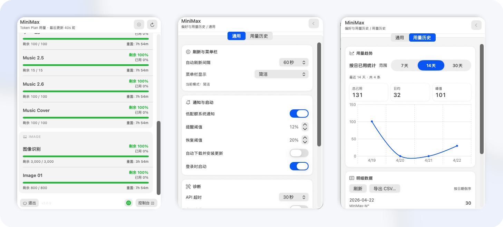
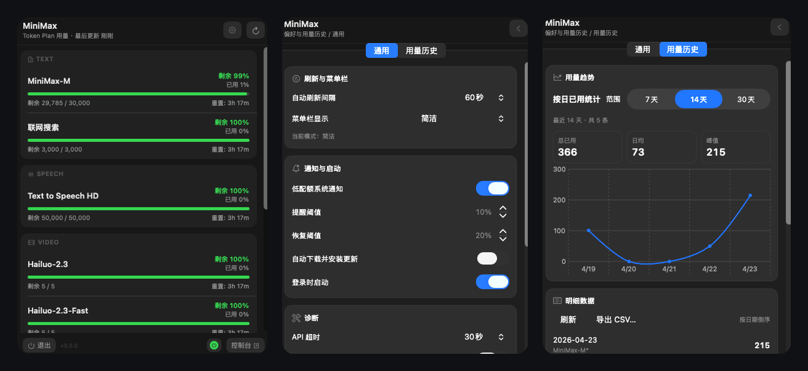
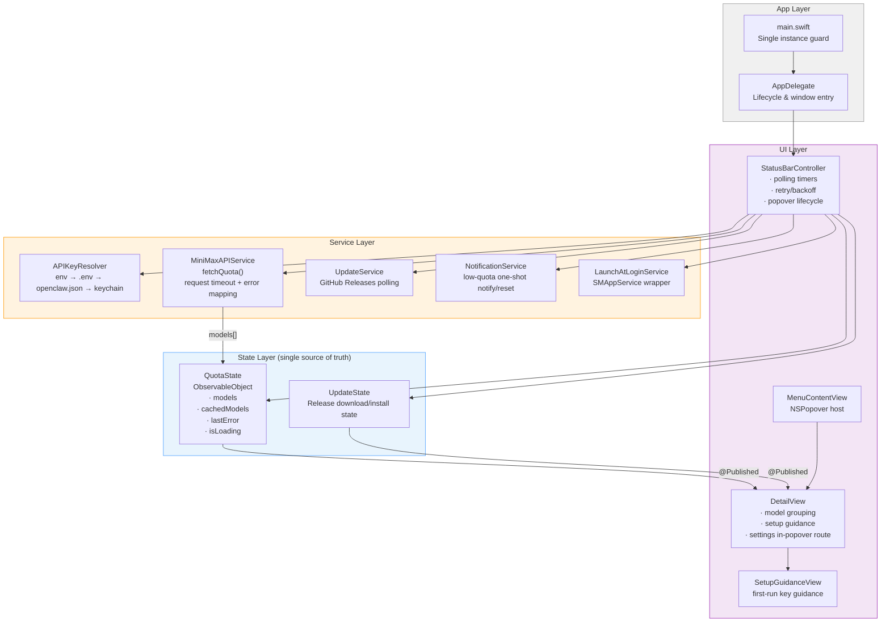
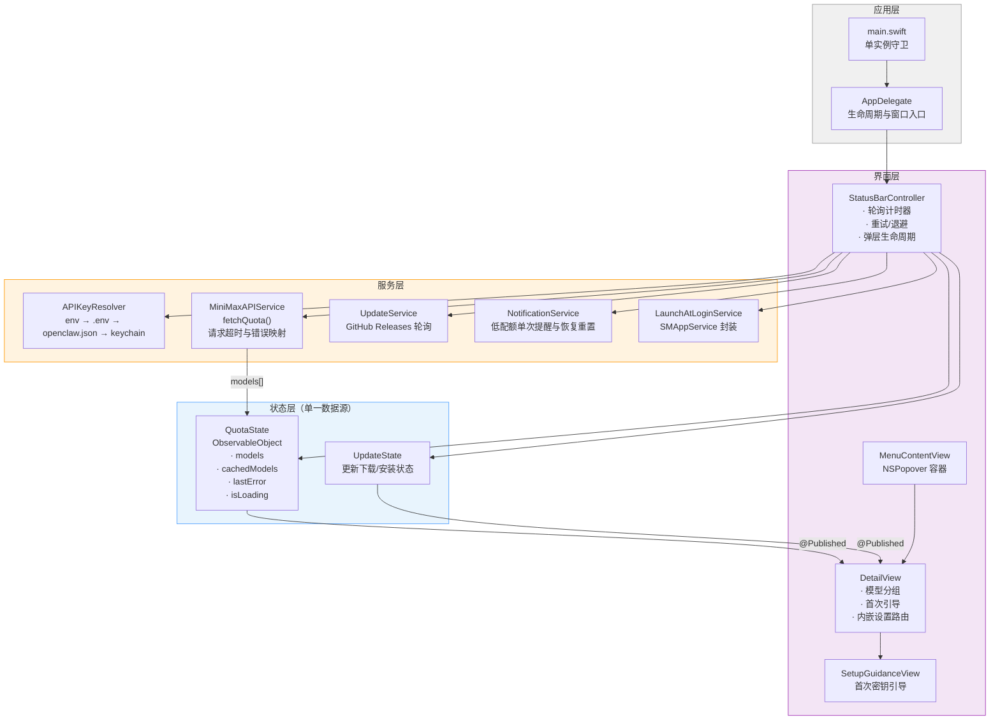

# MiniMax Status Bar

**MiniMax Status Bar for macOS | MiniMax Token Plan Monitor | Menu Bar Quota Tracker**  
**MiniMax 菜单栏状态栏工具（macOS）| Token Plan 用量监控 | 配额追踪**

`Keywords`: MiniMax, MiniMax Token Plan, Status Bar, Menu Bar, macOS, OpenClaw, SwiftUI  
`关键词`: MiniMax、Token Plan、状态栏、菜单栏、macOS、OpenClaw、SwiftUI

[English](#english) | [中文](#中文)  
[](https://github.com/victor0602/minimax-status-bar/releases/latest)
[](https://github.com/victor0602/minimax-status-bar/releases/latest)
[](https://swift.org)
[](LICENSE)

---

<div align="center">





</div>

---

## v1.3 Release Notes / 正式版更新

### English

- Migrated model display names to Chinese product labels for clarity (e.g., `MiniMax-M2.7` → `文本生成`, `hailuo-2.3` → `视频生成 · 标准版`)
- Fixed production-level thread safety issues: `NumberFormatter`/`DateFormatter` locked, blocking shell calls moved off `@MainActor`
- Fixed menu bar tooltip accumulation bug and added deduplication check
- Eliminated duplicate API service creation logic in `StatusBarController`
- Removed redundant `#available` checks (deployment target macOS 13.0)
- Cleaned up dead code in `APIConfigService`
- Added comprehensive regression test for all 13 display name mappings
- All 93 unit tests pass with 0 failures

### 中文

- 模型展示名称迁移为中文业务标签（如 `MiniMax-M2.7` → `文本生成`、`hailuo-2.3` → `视频生成 · 标准版`）
- 修复多线程安全问题：NumberFormatter/DateFormer 加锁保护、阻塞 shell 调用移出 @MainActor
- 修复菜单栏 tooltip 累积 bug，增加重复检测
- 消除 StatusBarController 中重复的 API Service 创建逻辑
- 删除冗余 `#available` 检查（部署目标已为 macOS 13.0）
- 清理 APIConfigService 死代码
- 补充全量 13 条 display name 映射回归测试
- 全部 93 个单元测试通过，0 失败

---

## English

### What It Is

`MiniMax Status Bar` is a menu bar first utility for developers who rely on MiniMax Token Plan daily.
It keeps quota status visible at a glance, without opening browser tabs or dashboards.

### Why It Stands Out

- **Glanceable**: menu bar percent + compact popover details.
- **Reliable semantics**: remaining/consumed display matches Token Plan expectations.
- **Resilient behavior**: cache fallback + retry strategy when API is unstable.
- **High interaction precision**: consistent hit targets and one-click interactions.
- **Low distraction**: LSUIElement app, no Dock icon, transient popover.

### Feature Highlights

- Auto API key resolution (`MINIMAX_API_KEY`, `.env`, OpenClaw config)
- Quota grouping by modality (Text / Speech / Video / Music / Image)
- Low-quota notification with recovery threshold reset
- Usage history analytics (7 / 14 / 30 days)
- In-app update check flow
- Setup guidance for invalid/missing key states

### Architecture



### Install

1. Download latest `.dmg` from [Releases](https://github.com/victor0602/minimax-status-bar/releases/latest)
2. Drag **MiniMax Status Bar.app** into `Applications`
3. If Gatekeeper blocks first launch:

```bash
xattr -cr "/Applications/MiniMax Status Bar.app"
```

### Build From Source

```bash
git clone https://github.com/victor0602/minimax-status-bar.git
cd minimax-status-bar
brew install xcodegen
xcodegen generate

xcodebuild \
  -project minimax-status-bar.xcodeproj \
  -scheme minimax-status-bar \
  -configuration Debug \
  -destination 'platform=macOS' \
  build
```

### Test

```bash
xcodebuild \
  -project minimax-status-bar.xcodeproj \
  -scheme minimax-status-bar \
  -configuration Debug \
  -destination 'platform=macOS' \
  test
```

### License

Licensed under the [MIT License](LICENSE).

---

## 中文

### 项目定位

`MiniMax Status Bar` 是一个面向高频 MiniMax 用户的菜单栏工具。  
目标是让你在开发过程中“瞟一眼就知道配额状态”，而不是频繁打开控制台页面。

### 核心亮点

- **信息高密但不干扰**：菜单栏显示关键百分比，下拉面板展示细节。
- **语义可信**：剩余/已用显示与 Token Plan 语义保持一致。
- **稳定容错**：接口波动时可回退缓存并重试，避免空白状态。
- **交互精准**：统一点击热区与按钮行为，降低误触和多次点击。
- **轻量存在感**：纯菜单栏形态，无 Dock 图标，按需弹出。

### 主要功能

- 自动解析 API Key（环境变量 / `.env` / OpenClaw 配置）
- 按模型类型分组展示配额（文本、语音、视频、音乐、图像）
- 低配额提醒与恢复阈值机制
- 用量历史统计（7 / 14 / 30 天）
- 应用内更新检测
- 首次配置与异常状态引导

### 架构图



### 安装方式

1. 从 [Releases](https://github.com/victor0602/minimax-status-bar/releases/latest) 下载最新 `.dmg`
2. 将 **MiniMax Status Bar.app** 拖入“应用程序”目录
3. 若首次启动被系统拦截，可执行：

```bash
xattr -cr "/Applications/MiniMax Status Bar.app"
```

### 本地构建

```bash
git clone https://github.com/victor0602/minimax-status-bar.git
cd minimax-status-bar
brew install xcodegen
xcodegen generate

xcodebuild \
  -project minimax-status-bar.xcodeproj \
  -scheme minimax-status-bar \
  -configuration Debug \
  -destination 'platform=macOS' \
  build
```

### 测试

```bash
xcodebuild \
  -project minimax-status-bar.xcodeproj \
  -scheme minimax-status-bar \
  -configuration Debug \
  -destination 'platform=macOS' \
  test
```

### 许可证

本项目采用 [MIT License](LICENSE)。
